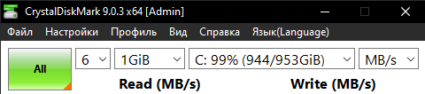

# Лабораторная работа №2
## Оценка качества работы жесткого диска

**Цель работы:** оценить качество работы жесткого диска с помощью специальных программ (CrystalDiskMark и CrystalDiskInfo).

**Оборудование и ПО:** ПК на Windows, программы CrystalDiskMark 9.0.3 и CrystalDiskInfo.

---

## Ход выполнения работы

### 1. Установка и настройка CrystalDiskMark

Для тестирования скорости диска была установлена и запущена утилита CrystalDiskMark (от имени администратора). В программе были установлены следующие параметры:
- Количество запусков теста: **6**
- Объём тестируемых данных: **1 GiB**
- Тестируемый диск: **C:**
  

*Рисунок 1 – Настройки программы перед запуском теста*

*Рисунок 2 – Выполнение тестов (заполнение шкал)*

После завершения тестирования были получены следующие результаты:

*Рисунок 3 – Финальные результаты тестирования*

**Результаты тестирования:**

| Тест | Чтение (MB/s) | Запись (MB/s) |
|------|---------------|---------------|
| SEQ1M Q8T1 | 538.07 | 473.79 |
| SEQ1M Q1T1 | 522.28 | 440.27 |
| RND4K Q32T1 | 164.51 | 191.04 |
| RND4K Q1T1 | 27.61 | 69.64 |

---

### 2. Анализ состояния диска с помощью CrystalDiskInfo

Для оценки технического состояния накопителя была запущена программа CrystalDiskInfo.

*Рисунок 4 – Общая информация о диске*

*Рисунок 5 – Параметры S.M.A.R.T. накопителя*

**Полученные данные о состоянии диска:**

| Параметр | Значение |
|----------|----------|
| Модель диска | Apacer AS350 1TB |
| Объём | 1024,2 GB |
| Интерфейс | SATA |
| Скорость вращения | SSD (без вращающихся частей) |
| Температура | 45 °C |
| Техническое состояние | Хорошо (100%) |
| Количество включений | 1420 раз |
| Общее время работы | 4004 часа |

---

## Вывод

В ходе выполнения лабораторной работы было проведено тестирование скорости чтения и записи накопителя Apacer AS350 1TB с помощью утилиты CrystalDiskMark, а также выполнена оценка его состояния по показателям S.M.A.R.T. с использованием CrystalDiskInfo.

**Анализ скорости:**
- Максимальная последовательная скорость чтения составила **538.07 MB/s**, записи — **473.79 MB/s**, что соответствует заявленным характеристикам SATA SSD.
- Скорость работы с мелкими блоками (RND4K Q1T1): чтение — **27.61 MB/s**, запись — **69.64 MB/s**, что является нормальным для данного типа накопителей.

**Анализ состояния:**
- Диск находится в **хорошем техническом состоянии (100%)**.
- Температура накопителя составляет **45 °C** — значение находится в допустимых пределах.
- Количество включений — **1420**, общее время наработки — **4004 часа**.
- Критические атрибуты S.M.A.R.T. (перераспределённые сектора, нестабильные сектора) имеют нулевые значения, что говорит об отсутствии проблем с диском.

**Итог:** Накопитель Apacer AS350 1TB полностью исправен, его скоростные характеристики соответствуют ожидаемым для SATA-накопителей. Диск пригоден для дальнейшей эксплуатации.

---

## Ответы на контрольные вопросы

### 1. Что такое жесткий диск?
Жесткий диск (HDD) — это устройство для долговременного хранения данных, работающее на принципе магнитной записи. Информация записывается на вращающиеся магнитные пластины с помощью подвижных считывающих головок. Данные сохраняются даже после отключения питания.

### 2. Внутреннее устройство жесткого диска
Основные элементы внутреннего устройства жесткого диска:
- **Магнитные пластины** — алюминиевые или стеклянные диски, покрытые слоем ферромагнитного материала, на который записываются данные.
- **Головки чтения/записи** — электромагнитные элементы, которые считывают и записывают информацию, "паря" над поверхностью пластин.
- **Шпиндельный двигатель** — вращает пластины с постоянной скоростью (обычно 5400 или 7200 об/мин).
- **Позиционер (актуатор)** — перемещает головки к нужным дорожкам на пластинах.
- **Контроллер** — электронная плата, управляющая всеми механизмами и обменом данных с компьютером.

### 3. Причины возникновения проблем с совместимостью
Проблемы с совместимостью жестких дисков могут возникать по следующим причинам:
- **Несоответствие интерфейса:** например, старый IDE-диск невозможно подключить к современной материнской плате с разъемами SATA или M.2.
- **Файловая система:** диск, отформатированный в файловой системе, которую не поддерживает операционная система (например, HFS+ в Windows).
- **Ограничения по объёму:** старые версии BIOS или 32-разрядные ОС не поддерживают диски больше 2 ТБ.
- **Устаревший BIOS:** для загрузки с дисков большого объёма и NVMe SSD требуется режим UEFI, а не Legacy BIOS.

### 4. Методы уменьшения проблем с совместимостью
Для решения проблем совместимости используются следующие методы:
- **Переходники и адаптеры:** например, SATA-USB или IDE-SATA для подключения старых дисков к новым системам.
- **Обновление BIOS/UEFI:** установка свежей версии прошивки для поддержки новых интерфейсов и больших объёмов.
- **Установка драйверов:** для поддержки файловых систем других ОС.
- **Использование GPT-разметки:** вместо MBR для использования полного объёма диска (>2 ТБ).
- **Обновление операционной системы:** до версии, поддерживающей современное оборудование.
