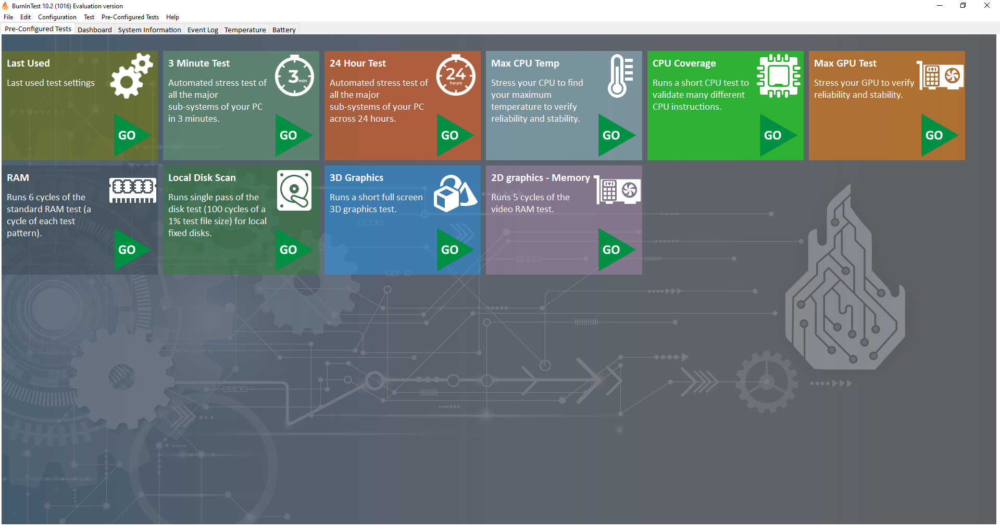
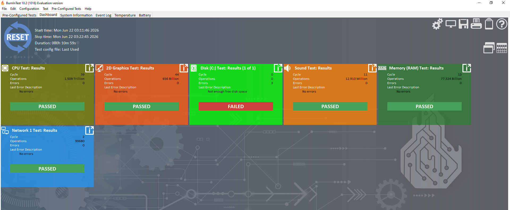

# Лабораторная работа №3
## Диагностика работоспособности персональных компьютеров

---

## 1. Цель работы

Проводить диагностику компьютера с помощью программ-диагностик.

---

## 2. Теоретические сведения

Программы для диагностики компьютера позволяют проверить конфигурацию компьютера (количество памяти, ее использование, типы дисков и т.д.), а также проверить работоспособность устройств компьютера (прежде всего жестких дисков). Они позволяют выявить «намечающиеся» дефекты дисков (возникающие из-за износа магнитной поверхности диска) и предотвратить потерю данных, хранящихся на диске.

С помощью тестового программного продукта или диагностического комплекса можно определить ряд несложных неисправностей аппаратуры или неправильного конфигурирования системных файлов. Диагностика может выполняться как для системы в целом, так и для отдельных модулей: системной платы, памяти (стандартной, дополнительной и расширенной), видеоподсистемы, жестких дисков, приводов флоппи-дисков, клавиатуры, портов (последовательных и параллельных), координатных устройств, приводов компакт-дисков (CD-ROM) и устройств, имеющих SCSI-интерфейс и т.д.

### Программа PassMark BurnInTest

Программа для испытания компьютера «на прочность». BurnInTest тестирует стабильность и надёжность ПК, синхронно распределяя нагрузку на все подсистемы, позволяя осуществлять проверку скорости процессора, оперативной памяти, жестких дисков, CD/DVD приводов, звуковых и видеокарт, принтеров, сетевых устройств.

---

## 3. Порядок выполнения работы

1. В сетевой папке выбран файл `bitstd.exe`.
2. Установлена программа BurnInTest.
3. Программа запущена.

*Рисунок 1 – Главное окно программы*

4. В развертывающемся списке **Quicktest** представлены различные виды тестов для диагностики ПК.

**Задание:** Провести диагностику компьютера по каждому из предложенных видов теста.

---

## 4. Результаты диагностики

Результаты каждого теста занесены в таблицу:

### Итоговая таблица результатов тестов BurnInTest

| Test name | Cycle | Operations | Errors | Last error Description |
|-----------|-------|------------|--------|------------------------|
| **CPU Test** | 1 509 000 000 000 | 0 | 0 | No errors |
| **2D Graphics** | 656 000 000 000 | 0 | 0 | No errors |
| **Sound** | 12 910 000 | 0 | 0 | No errors |
| **Memory (RAM)** | 11 | 12 910 000 | 0 | No errors |
| **Network** | 2 | 99 680 | 0 | No errors |
| **Disk (C:)** | 0 | 0 | 0 | Not enough free disk space |
| **3D Graphics** | — | — | — | Не тестировалось |

> *Примечание:* Тест 3D Graphics не проводился, так как данная конфигурация не поддерживает 3D-тестирование (отсутствует дискретная видеокарта, либо тест был пропущен в настройках).

*Рисунок 4 – Итоговые результаты диагностики*

---

## 5. Анализ полученных результатов

### CPU Test
Тест процессора пройден успешно. Выполнено более 1,5 триллиона операций без единой ошибки. Процессор работает стабильно и корректно.

### 2D Graphics
Тест 2D-графики пройден успешно. Обработано более 656 миллиардов операций. Ошибок не зафиксировано, графическая подсистема работает нормально.

### Sound
Тест звуковой подсистемы пройден успешно. Ошибок не выявлено, звуковое устройство функционирует корректно.

### Memory (RAM)
Тест оперативной памяти пройден успешно. Выполнено 11 циклов, обработано более 12,9 миллионов операций. Ошибок не обнаружено, модули памяти исправны.

### Network
Тест сетевой подсистемы пройден успешно. Ошибок не выявлено, сетевое устройство работает стабильно.

### Disk (C:)
Тест жёсткого диска **не пройден**. Причина: недостаточно свободного места на диске C:. Это не аппаратная неисправность — проблема решается очисткой диска (удаление временных файлов, очистка корзины, перенос данных).

---

## 6. Вывод

В результате выполнения лабораторной работы была проведена диагностика ПК с помощью программы BurnInTest.

**Основные выводы:**
- Программы для диагностики необходимы для проверки конфигурации, мониторинга состояния компонентов, выявления неисправностей на ранней стадии и предотвращения потери данных.
- BurnInTest позволяет провести нагрузочное тестирование ("прогонку") ПК, выявляя скрытые дефекты.
- Большинство тестов (CPU, 2D Graphics, Sound, RAM, Network) пройдены успешно — компьютер стабилен.
- **Выявлена проблема:** Тест диска C: не пройден из-за недостатка свободного места. Это не аппаратная неисправность, а программная проблема.

**Заключение:** Компьютер находится в работоспособном состоянии. Единственная проблема — переполненный диск, что требует внимания пользователя.

---

## 7. Ответы на контрольные вопросы

### 1. Для чего необходимы программы для диагностики ПК?

Для проверки реальной конфигурации компьютера, мониторинга состояния компонентов (температура, износ), выявления неисправностей на ранней стадии, тестирования стабильности после разгона или замены комплектующих, предотвращения потери данных.

### 2. Назначение программы BurnInTest

Это утилита для стресс-тестирования ("прожига") ПК. Она создаёт максимальную одновременную нагрузку на CPU, RAM, GPU и диски, чтобы проверить систему на стабильность работы в экстремальных условиях и выявить ошибки, связанные с перегревом или дефектами оборудования.

### 3. Что такое тестирование?

В контексте диагностики — это процесс выполнения контролируемых задач (тестов) на оборудовании с целью проверки его функциональности, производительности и соответствия заданным спецификациям. Это способ выявить скрытые ошибки.

### 4. Виды тестирования программных продуктов

В контексте диагностики ПК можно выделить следующие виды:
- **Функциональное тестирование** — проверка работоспособности устройства.
- **Нагрузочное тестирование (Stress Test)** — проверка работы на пределе возможностей.
- **Тестирование производительности (Benchmark)** — замер скорости работы.
- **Тестирование стабильности** — работа под нагрузкой в течение длительного времени.

---
