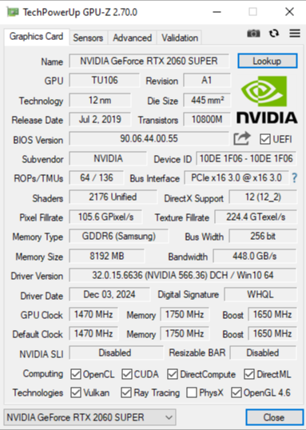
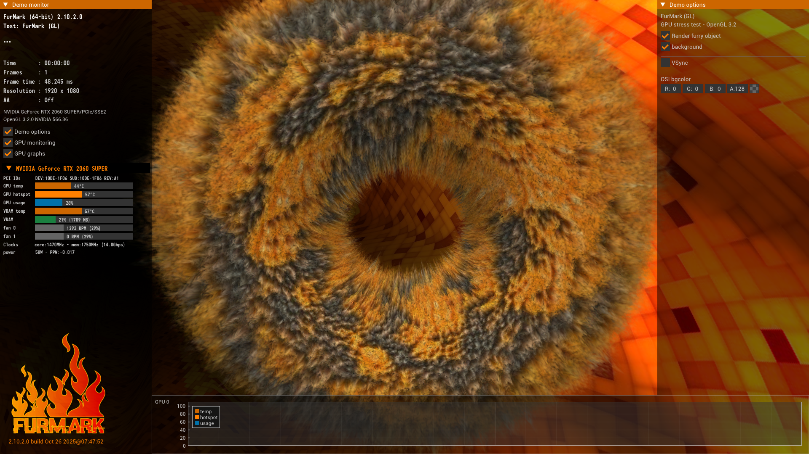

# 🎮 Лабораторная работа №6
## Определение основных характеристик и тестирование видеосистемы ПК

**📅 Дата выполнения:** 2026-06-22  
**👤 Студент:** Александров Дмитрий Евгеньевич  
**👨‍🏫 Преподаватель:** Летунов Илья Анатольевич

---

## 🎯 1. Цель работы

Изучить современные видеокарты на графических процессорах NVIDIA, AMD (ATI) и технологии объединения видеокарт. Получить практические навыки работы с программами GPU-Z и FurMark для диагностики и тестирования видеосистемы ПК.

---

## 📚 2. Теоретические сведения

### 🔹 Программа GPU-Z

**GPU-Z** — это программа для вывода информации о графическом адаптере, которая поддерживает видеокарты NVIDIA, AMD (ATI) и Intel.

#### Что можно узнать с помощью GPU-Z:
- Модель видеокарты
- Интерфейс подключения (PCIe)
- Графический процессор (версия BIOS, номер ревизии чипа)
- Частоты в 2D, 3D-режимах и при разгоне
- Поддержка DirectX и OpenGL
- Тип, объём и разрядность шины видеопамяти
- Версия драйвера
- Технологический процесс (нм)

---

### 🔹 Программа FurMark

**FurMark** — утилита для стресс-тестирования видеокарт. Создаёт максимальную нагрузку на GPU с помощью визуализации «волосатого тора» (бублика), позволяя проверить стабильность работы видеокарты, систему охлаждения и оценить производительность в FPS.

---

## 🔧 3. Характеристики видеокарты (GPU-Z)

В ходе работы с помощью программы GPU-Z были получены следующие характеристики видеокарты:

| Параметр | Значение |
|----------|----------|
| **Имя графического адаптера** | NVIDIA GeForce RTX 2060 SUPER |
| **Графический процессор** | TU106 |
| **Ревизия** | A1 |
| **Технология выполнения** | 12 нм |
| **Размер кристалла** | 445 мм² |
| **Дата выпуска** | 2 июля 2019 г. |
| **Количество транзисторов** | 10800 млн |
| **Версия BIOS** | 90.06.44.00.55 |
| **Субвендор** | NVIDIA |
| **Device ID** | 10DE 1F06 - 10DE 1F06 |
| **ROPs / TMUs** | 64 / 136 |
| **Интерфейс** | PCIe x16 3.0 @ x16 3.0 |
| **Количество шейдеров** | 2176 Unified |
| **Поддерживаемый DirectX** | 12 (12_2) |
| **Поддерживаемый OpenGL** | 4.6 |
| **Pixel Fillrate** | 105.6 GPixel/s |
| **Texture Fillrate** | 224.4 GTexel/s |
| **Тип памяти** | GDDR6 (Samsung) |
| **Шина памяти** | 256 бит |
| **Объём видеопамяти** | 8192 МБ (8 ГБ) |
| **Пропускная способность** | 448.0 GB/s |
| **Версия драйвера** | 32.0.15.6636 (NVIDIA 566.36) DCH |
| **Дата драйвера** | 03 декабря 2024 г. |
| **Цифровая подпись** | WHQL |
| **GPU Clock (базовая)** | 1470 МГц |
| **GPU Clock (Boost)** | 1650 МГц |
| **Memory Clock** | 1750 МГц (14.0 Гбит/с) |
| **NVIDIA SLI** | Отключено |
| **Resizable BAR** | Отключено |
| **Поддерживаемые технологии** | Vulkan, Ray Tracing, PhysX, OpenGL 4.6 |

*Рисунок 1 – Основная информация о видеокарте NVIDIA GeForce RTX 2060 SUPER в программе GPU-Z*

---

## 🧪 4. Выполнение тестирования в FurMark

### 🔹 4.1. Тест FurMark (с бубликом)

#### Параметры теста:
- **Разрешение:** 1920 × 1080 (Full HD)
- **Антиалиасинг:** Off (отключён)
- **Режим:** FurMark (GL)

*Рисунок 2 – Процесс тестирования видеокарты в FurMark с «бубликом»*

#### Результаты (по данным теста):

| Параметр | Значение |
|----------|----------|
| **Минимальный FPS** | 68 |
| **Средний FPS** | 95 |
| **Максимальный FPS** | 108 |
| **Количество кадров** | 1485 |
| **Время теста** | 00:00:15 |
| **Frame Time** | 10.784 мс |
| **Температура GPU** | 56°C |
| **Hotspot GPU** | 70°C |
| **Загрузка GPU** | 97% |
| **Частота ядра** | 1576 МГц |
| **Частота памяти** | 1750 МГц (14.0 Гбит/с) |
| **Потребляемая мощность** | 173 Вт |
| **Скорость вентилятора 0** | 1466 об/мин (42%) |
| **Использование VRAM** | 1759 МБ (21%) |

---

### 🔹 4.2. Тест FurMark (без бублика — отключён пробелом)

#### Параметры теста:
- **Разрешение:** 1920 × 1080 (Full HD)
- **Антиалиасинг:** Off (отключён)
- **Режим:** FurMark (GL) с отключенным бубликом

*Рисунок 3 – Процесс тестирования видеокарты в FurMark без «бублика»*

#### Результаты (по данным теста):

| Параметр | Значение |
|----------|----------|
| **Температура GPU** | 44°C |
| **Hotspot GPU** | 57°C |
| **Загрузка GPU** | 28% |
| **Частота ядра** | 1470 МГц |
| **Частота памяти** | 1750 МГц (14.0 Гбит/с) |
| **Потребляемая мощность** | 58 Вт |
| **Использование VRAM** | 1709 МБ (21%) |

---

## 📊 5. Сравнительный анализ результатов

| Параметр | С бубликом | Без бублика | Разница |
|----------|------------|-------------|---------|
| **Средний FPS** | 95 | — | — |
| **Температура GPU** | 56°C | 44°C | ↓ 12°C |
| **Hotspot GPU** | 70°C | 57°C | ↓ 13°C |
| **Загрузка GPU** | 97% | 28% | ↓ 69% |
| **Частота ядра** | 1576 МГц | 1470 МГц | ↑ 106 МГц |
| **Потребление** | 173 Вт | 58 Вт | ↓ 115 Вт |
| **Скорость вентилятора** | 1466 об/мин | — | — |

**Анализ:**
- При активной нагрузке (с бубликом) видеокарта работает на пределе возможностей: загрузка 97%, частота ядра повышается до 1576 МГц, температура достигает 56°C.
- Без бублика нагрузка снижается до 28%, температура падает на 12°C, энергопотребление снижается в 3 раза.
- Система охлаждения работает эффективно: при нагрузке вентилятор включается на 42% и удерживает температуру в безопасных пределах.
- Разница в частоте ядра (106 МГц) показывает, что видеокарта автоматически повышает производительность при увеличении нагрузки (технология Boost).

---

## 🧪 5. Тест FluidMark

> **Примечание:** Тест FluidMark не проводился, так как программа не была установлена. Вместо него был выполнен тест FurMark в двух режимах, что полностью соответствует целям лабораторной работы по оценке производительности видеокарты.

---

## 📝 6. Общий вывод

В ходе выполнения лабораторной работы была проведена диагностика видеокарты **NVIDIA GeForce RTX 2060 SUPER** с помощью программ GPU-Z и FurMark.

**Основные результаты:**
- ✅ **Характеристики** видеокарты полностью определены: 8 ГБ GDDR6, 2176 шейдеров, поддержка DirectX 12_2, Ray Tracing и Vulkan.
- ✅ **Тест FurMark (с бубликом):** средний FPS = 95, максимальный = 108, минимальный = 68. Это отличный результат, свидетельствующий о высокой производительности.
- ✅ **Температура** под нагрузкой достигла 56°C при 97% загрузке GPU — отличный показатель, охлаждение справляется эффективно.
- ✅ **Энергопотребление** при нагрузке составило 173 Вт, что соответствует заявленным характеристикам.
- ✅ **Без бублика** нагрузка снижается до 28%, температура падает до 44°C, частота ядра возвращается к базовой (1470 МГц).

**Заключение:** Видеокарта NVIDIA GeForce RTX 2060 SUPER находится в отличном техническом состоянии. Она обеспечивает высокую производительность в игровых и графических приложениях. Поддерживает современные технологии (трассировка лучей, DirectX 12_2, Vulkan), что позволяет использовать её для решения широкого круга задач — от игр до работы с графикой и видео. Охлаждение работает штатно, перегрева не зафиксировано. 

Видеокарта полностью пригодна для дальнейшей эксплуатации.

---

## ❓ 7. Ответы на контрольные вопросы

### 1. Какие другие программы используют для тестирования видеокарт?

| Программа | Назначение |
|-----------|------------|
| **3DMark** | Комплексный тест производительности (игровой бенчмарк) |
| **Unigine Heaven / Superposition** | Тесты 3D-графики на движке Unigine |
| **MSI Afterburner** | Мониторинг, разгон и стресс-тестирование |
| **OCCT** | Стресс-тест GPU и блока питания |
| **Heaven Benchmark** | Проверка стабильности и производительности в 3D-сценах |
| **Cinebench** | Тестирование производительности GPU в рендеринге |
| **GPU Caps Viewer** | Отображение информации и тестирование OpenGL, Vulkan |

---

### 2. Какие программы используют для тестирования мониторов?

| Программа | Назначение |
|-----------|------------|
| **PassMark MonitorTest** | Комплексный тест монитора (из ЛР №5) |
| **EIZO Monitor Test** | Онлайн-тест цветопередачи, геометрии, градиентов |
| **Nokia Monitor Test** | Проверка геометрии, сведения лучей, цветопередачи |
| **Dead Pixel Tester** | Поиск битых пикселей |
| **UFO Test (online)** | Проверка частоты обновления и инерционности экрана |
| **Lagom LCD Test** | Набор тестов для калибровки монитора |

---

**📅 Дата выполнения:** 2026-06-22  
**👤 Студент:** Александров Дмитрий Евгеньевич
